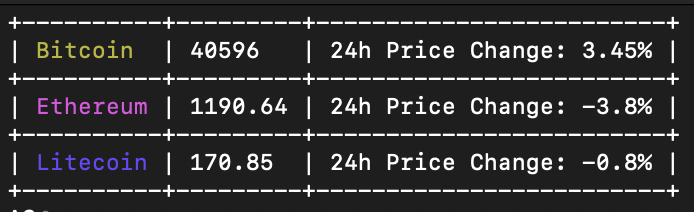

## coke

A cryptocurrency price tracker written in Rust.

### Usage

```
coke 0.0.1
Santiago Ramirez <santiirepair@gmail.com>
A cryptocurrency price tracker written in Rust.

USAGE:
    coke <TOKENS>

ARGS:
    <TOKENS>    additional tokens that you can add to track, like ripple,stellar

```

### Installation

Via cargo

```
cargo install coke
```

### Screenshot



### License

This project is license used the GPL-3.0 license. See [LICENSE](LICENSE) for more details.
